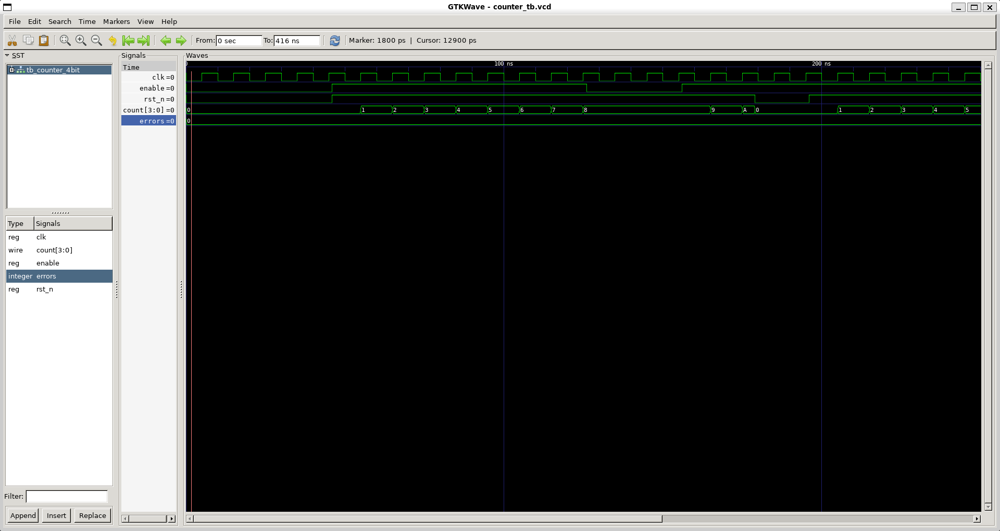

# 4-Bit Synchronous Counter — RTL to GDS

A complete RTL-to-GDSII implementation of a 4-bit synchronous binary counter
(Mod-16) using the fully open-source **OpenLane 2** flow and **SkyWater 130nm PDK**.

Built as a first end-to-end physical design exercise — every stage from
writing Verilog to generating a fabrication-ready GDSII file is documented
here with real tool outputs and report numbers.

---

## Design Specifications

| Parameter           | Value                              |
|---------------------|------------------------------------|
| Technology          | SkyWater sky130 (130nm)            |
| Design              | 4-bit synchronous binary counter   |
| Modulus             | Mod-16 (counts 0 → 15 → 0)        |
| Clock frequency     | 100 MHz (10 ns period)             |
| Reset               | Active-low asynchronous (`rst_n`)  |
| Enable              | Synchronous count enable           |
| Tool flow           | OpenLane 2.3.10                    |
| PDK                 | sky130A (SkyWater 130nm)           |

---

## Port Description

| Port      | Direction | Width | Description                      |
|-----------|-----------|-------|----------------------------------|
| `clk`     | Input     | 1     | Clock input                      |
| `rst_n`   | Input     | 1     | Active-low asynchronous reset    |
| `enable`  | Input     | 1     | Count enable (high = counting)   |
| `count`   | Output    | 4     | 4-bit counter value output       |

---

## Project Structure

```
4_BIT_COUNTER/
├── src/
│   ├── 4_bit_counter.v        # RTL design (Verilog)
│   └── tb_counter_4bit.v      # Self-checking testbench with tasks
├── config.json                # OpenLane flow configuration
├── docs/
│   └── waveform.png           # GTKWave simulation waveform screenshot
├── results/
│   ├── synthesis/
│   │   └── counter_4bit.nl.v  # Gate-level netlist (post-synthesis)
│   ├── reports/
│   │   ├── synthesis_stat.rpt # Cell count and area report (Yosys)
│   │   ├── sta_timing.rpt     # Post-route STA timing report (OpenSTA)
│   │   └── drc.rpt            # DRC clean report (Magic)
│   └── gds/
│       └── counter_4bit.gds   # Final GDSII layout (fabrication-ready)
└── README.md
```

---

## Complete Flow — Stage by Stage

### Stage 1: RTL Design

Written in synthesizable Verilog. Key design decisions:
- **Synchronous counter** (not ripple) — all flip-flops share the same
  clock, carry logic is purely combinational. Ripple counters cascade
  clock edges through flip-flop outputs, causing timing issues that EDA
  tools handle poorly.
- **Active-low async reset** — industry standard; reset takes effect
  immediately on `rst_n` falling edge without waiting for a clock edge.
- **Synchronous enable** — `count` only increments on a clock edge when
  `enable` is high; freezes cleanly otherwise.

```verilog
module counter_4bit (
    input  wire        clk,
    input  wire        rst_n,
    input  wire        enable,
    output reg  [3:0]  count
);
    always @(posedge clk or negedge rst_n) begin
        if (!rst_n)
            count <= 4'b0000;
        else if (enable)
            count <= count + 1;
    end
endmodule
```

### Stage 2: Functional Verification

Self-checking testbench using Verilog tasks — each task tests one
specific behavior in isolation:

| Task | What it tests |
|---|---|
| `apply_reset` | Reset forces count to 0, confirmed at posedge |
| `check_increment` | Count increments correctly for N clock cycles |
| `check_enable_freeze` | Count freezes when enable=0 |
| `check_async_reset` | Reset takes effect mid-cycle, no clock edge needed |
| `check_wraparound` | Count wraps naturally from 15 back to 0 |

**Result: All tests passed — 0 errors**

### Stage 3: Simulation Waveform



Waveform shows (left to right):
- `rst_n` low → `count` held at 0
- `rst_n` released, `enable` high → count increments each clock edge
- `enable` pulled low → count freezes
- Async reset mid-cycle → count snaps to 0 immediately (no clock edge)
- Count wraps from 15 → 0 naturally on 4-bit overflow

### Stage 4: Logic Synthesis (Yosys + ABC)

Converts RTL (`count <= count + 1`) into a gate-level netlist using
real sky130 standard cells.

**Synthesis statistics (real numbers from `stat.rpt`):**

| Metric | Value |
|---|---|
| Total cells | 11 |
| Sequential cells (DFFs) | 4 × `sky130_fd_sc_hd__dfrtp_2` |
| Combinational cells | 7 |
| Cell area | 180.17 µm² |
| Sequential area | 105.10 µm² (58.3% of cell area) |
| Wires | 11 |
| Wire bits | 14 |

**Cells instantiated in the netlist:**

| Cell | Count | Function |
|---|---|---|
| `sky130_fd_sc_hd__dfrtp_2` | 4 | D flip-flop with reset — one per counter bit |
| `sky130_fd_sc_hd__xor2_2` | 2 | XOR gate — part of incrementer logic |
| `sky130_fd_sc_hd__a21oi_2` | 1 | AND-OR-Invert — carry logic |
| `sky130_fd_sc_hd__and3_2` | 1 | 3-input AND — carry generation |
| `sky130_fd_sc_hd__and4_2` | 1 | 4-input AND — carry generation |
| `sky130_fd_sc_hd__nor2_2` | 1 | NOR gate — enable/reset control |
| `sky130_fd_sc_hd__o21ba_2` | 1 | OR-AND-Invert — carry logic |

The naming convention: `sky130_fd_sc_hd` = SkyWater 130nm Foundry
Standard Cell High-Density library. `_2` = drive strength 2.

### Stage 5: Floorplanning (OpenROAD)

- Die area fixed at **50 × 50 µm** (2500 µm²) via `config.json`
- Core area: **1051 µm²** (after power ring margins)
- I/O pins placed on die boundary: `clk`, `rst_n`, `enable`, `count[3:0]`
- Power rings (VDD/VSS) generated around the core

### Stage 6: Placement (OpenROAD — RePlAce + Detailed Placement)

- All 11 standard cells placed in legal rows
- Global placement minimizes wire length
- Detailed placement legalizes positions to exact cell site boundaries
- Remaining space filled with decap and filler cells (visible in GDS as
  `sky130_fd_sc_hd__decap_*` — not your logic, but required for density
  and power integrity rules)

### Stage 7: Clock Tree Synthesis (TritonCTS)

With 4 flip-flops, CTS builds a real clock tree — unlike a single DFF
where CTS has nothing to balance and skips entirely.

CTS inserts clock buffers between the clock port and each DFF's clock
pin to ensure all 4 flip-flops see the clock edge at nearly the same
time (minimizing clock skew).

### Stage 8: Routing (FastRoute + TritonRoute)

- Global routing: plans approximate wire paths on each metal layer
- Detailed routing: lays down actual metal wires and vias
- Antenna repair runs after routing to fix charge-buildup violations

### Stage 9: Static Timing Analysis (OpenSTA)

STA ran across **9 process/voltage/temperature (PVT) corners** — the
same multi-corner analysis used at product companies:

| Corner | Hold Slack | Setup Slack | Violations |
|---|---|---|---|
| Overall worst | +0.1546 ns | +6.0786 ns | 0 |
| nom_tt_025C_1v80 (typical) | +0.3889 ns | +6.8837 ns | 0 |
| nom_ss_100C_1v60 (slow/hot) | +0.8791 ns | +6.0846 ns | 0 |
| nom_ff_n40C_1v95 (fast/cold) | +0.1583 ns | +7.1698 ns | 0 |

**All slack values are positive → timing closure achieved with no violations.**

Key insight: the **hold slack is tightest at the fast/cold/high-voltage**
corner (`ff_n40C_1v95`) — fast corners switch quickly, reducing the time
data is held stable at the receiving flip-flop input. The **setup slack is
tightest at the slow/hot/low-voltage** corner (`ss_100C_1v60`) — slow
corners take longer to propagate data through combinational logic, leaving
less margin before the next clock edge. This is exactly the MCMM analysis
pattern you study for PD interviews.

### Stage 10: Physical Verification

| Check | Tool | Result |
|---|---|---|
| DRC (Design Rule Check) | Magic + KLayout | ✅ Clean — 0 violations |
| LVS (Layout vs Schematic) | Netgen | ✅ Clean — layout matches netlist |
| Antenna check | OpenROAD | ✅ Passed |

### Stage 11: Final GDSII

Final layout generated at `results/gds/counter_4bit.gds`.

**Final layout metrics:**

| Metric | Value |
|---|---|
| Die area | 2500 µm² (50 × 50 µm) |
| Core area | 1051 µm² |
| Cell area used | 327.8 µm² |
| Core utilization | ~31% |
| Standard cell count (with filler) | 37 |
| Logic cell count (your design) | 11 |
| DRC violations | 0 |
| LVS result | Clean |

---

## Flow Results Summary

```
RTL Simulation  →  PASS (0 errors, all tasks)
Synthesis       →  11 cells, 180.17 µm² cell area
Floorplan       →  50×50 µm die, 31% utilization
Placement       →  Legal, congestion-free
CTS             →  Clock tree built for 4 flip-flops
Routing         →  Clean, no DRC during routing
STA             →  Setup +6.07 ns, Hold +0.15 ns — no violations
DRC             →  PASS ✅
LVS             →  PASS ✅
Antenna         →  PASS ✅
```

---

## Tool Stack

| Stage | Open-Source Tool | Commercial Equivalent |
|---|---|---|
| RTL Simulation | Icarus Verilog + GTKWave | Synopsys VCS / Cadence Xcelium |
| Synthesis | Yosys + ABC | Synopsys Design Compiler / Cadence Genus |
| Floorplan & Placement | OpenROAD (RePlAce) | Cadence Innovus |
| Clock Tree Synthesis | TritonCTS (OpenROAD) | Cadence Innovus CTS |
| Routing | TritonRoute (OpenROAD) | Cadence Innovus NanoRoute |
| Static Timing Analysis | OpenSTA (OpenROAD) | Synopsys PrimeTime |
| Parasitic Extraction | OpenRCX (OpenROAD) | Synopsys StarRC / Cadence QRC |
| DRC | Magic + KLayout | Mentor Calibre DRC |
| LVS | Netgen | Mentor Calibre LVS |
| Layout Viewer | KLayout | Cadence Virtuoso / KLayout |
| Flow Orchestration | OpenLane 2.3.10 | Cadence Genus-Innovus RTL-to-GDS |

---

## How to Reproduce

### Prerequisites
- Windows 10/11 with WSL2 (Ubuntu 22.04)
- Docker Desktop with WSL2 integration enabled
- OpenLane 2 installed

### 1. Set up WSL2

```powershell
# In PowerShell (run as Administrator)
wsl --install -d Ubuntu-22.04
wsl --set-default-version 2
```

### 2. Set up Docker Desktop

Download from https://www.docker.com/products/docker-desktop

After installing:
- Settings → General → enable "Use the WSL 2 based engine"
- Settings → Resources → WSL Integration → enable Ubuntu-22.04
- Apply & Restart

### 3. Install OpenLane inside WSL

```bash
sudo apt update
sudo apt install -y python3 python3-pip git build-essential iverilog gtkwave
python3 -m pip install openlane

# verify installation
python3 -m openlane --dockerized --smoke-test
```

### 4. Clone and simulate

```bash
git clone https://github.com/SAGARM-07/4_BIT_COUNTER.git
cd 4_BIT_COUNTER/src

iverilog -o sim.out -g2012 tb_counter_4bit.v 4_bit_counter.v
vvp sim.out
gtkwave counter_tb.vcd
```

Expected simulation output:
```
PASS: reset holds count at 0
PASS: count=1 correct
PASS: count=2 correct
...
ERRORS: 0
RESULT: ALL TESTS PASSED
```

### 5. Run RTL to GDS flow

```bash
cd ..   # back to project root (where config.json is)
python3 -m openlane --dockerized config.json
```

Expected final output:
```
* Antenna   Passed ✅
* LVS       Passed ✅
* DRC       Passed ✅
Flow complete.
```

### 6. View the layout

```bash
klayout results/gds/counter_4bit.gds
```

---

## Key Learnings

### 1. CTS requires multiple flip-flops to be meaningful
A single DFF produced: `[CTS-0041] Net "clk" has 1 sink. Skipping.`
The 4-bit counter (4 DFFs) produces a real clock tree with measurable
skew and latency values. CTS exists to balance clock arrival across
multiple registers — with one register, there is nothing to balance.

### 2. Synthesis maps RTL to real physics
`count <= count + 1` became 4 DFF cells + 7 combinational cells (XOR,
AND, NOR, AOI gates) from the sky130 standard cell library. Each cell
is a characterized, pre-laid-out block of transistors whose timing and
power the tool knows precisely.

### 3. STA runs across multiple PVT corners, not just one
Timing was checked at 9 corners (3 process × 3 voltage/temp
combinations). Hold timing is tightest at fast/cold/high-voltage (data
arrives quickly, less hold margin). Setup timing is tightest at
slow/hot/low-voltage (data propagates slowly, less setup margin). Both
must pass simultaneously at all corners.

### 4. Most of the GDS is not your logic
Of 37 total placed cells, only 11 are your counter logic. The remaining
26 are decap and filler cells inserted automatically to satisfy power
integrity requirements and density design rules. This is standard in all
real chips.

### 5. Every open-source tool maps to a commercial equivalent
This entire flow is conceptually identical to what PD engineers run at
Qualcomm, Intel, NVIDIA, AMD using Synopsys/Cadence tools. The stages,
reports, and failure modes are the same — only the tool names and
execution speed differ.

---

## Next Project

**UART IP** (Universal Asynchronous Receiver/Transmitter) — a complete
serial communication IP with TX module, RX module, baud rate generator,
and a register-bus interface. RTL already written and functionally
verified (23/23 testbench checks passing). Next step: run through the
same OpenLane flow and analyze a more complex design with real CTS
challenges (~20 flip-flops), multi-bit buses, and meaningful timing
paths through the oversampling logic.

---

## References

- [OpenLane 2 Documentation](https://openlane2.readthedocs.io)
- [SkyWater sky130 PDK](https://github.com/google/skywater-pdk)
- [OpenROAD Project](https://openroad.readthedocs.io)
- [Yosys Open Synthesis Suite](https://yosyshq.net/yosys)
- [Magic VLSI Layout Tool](http://opencircuitdesign.com/magic)
- [Netgen LVS Tool](http://opencircuitdesign.com/netgen)
